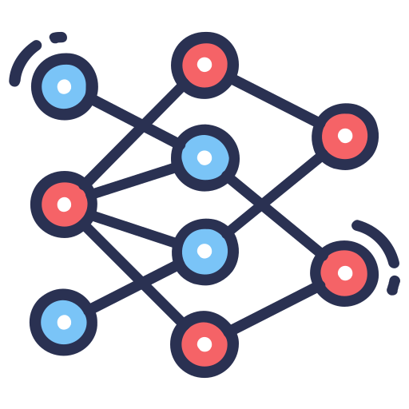

<h1 align="center">
  
</h1>

<h5 align="center">
  <code>
    <a href="https://www.linkedin.com/in/mohdelite/" title="LinkedIn Profile"> LinkedIn</a></code>
  <code><a href="https://stackoverflow.com/users/12371010/mohdelite" title="Stack Overflow Profile"> Stack Overflow</a></code>
  <code><a href="https://www.instagram.com/mohd3lite/" title="Instagram Profile"> Instagram</a></code>
</h5>
 

  Hi, I'm Mohammad, AI & Django Developer from Iran
   
   
  🔬 I'm MASc student in Artificial Intelligence at Yazd University
   
  💻 I love writing code and learning new things
   
  📚 I’m currently learning how to build E-Commerce Website with Django
   
  💬 Ask me anything about from <a href="https://github.com/mohdelite/mohdelite/issues" title="Issues">Here</a>
   
  📫 How to reach me: <a href="mailto: mohdelite76@gmail.com">mohdelite76@gmail.com</a>

<h2 align="center">💥 Languages & Technologies  & Tools 💥</h2>
 

  <code></code>
  <code></code>
  <code></code>
  <code></code>
  <code></code>
  <code></code>
  <code></code>
  <code></code>
  <code></code>
  <code></code>
  <code></code>
  <code></code>
  <code></code>
  <code></code>
  <code></code>

